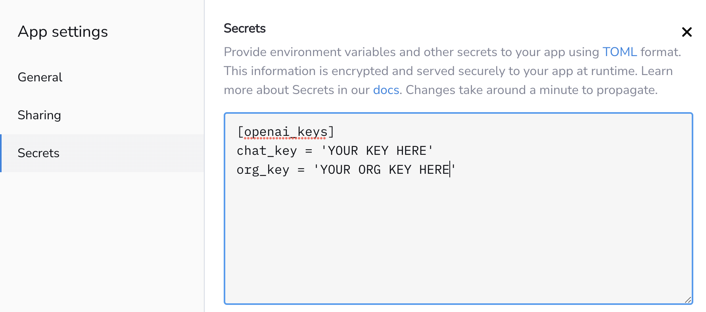
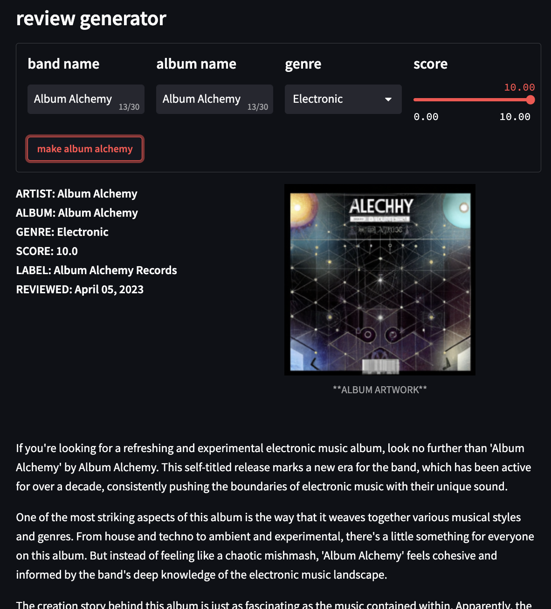

# Welcome to Album Alchemy
[](https://album-alchemy.streamlit.app/)

<!-- 
[Image generated using Stable Diffusion] -->

> Strictly considered, writing about music is as illogical as singing about economics. All the other arts can be talked about in the terms of ordinary life and experience. A poem, a statue, a painting or a play is a representation of somebody or something, and can be measurably described (the purely aesthetic values aside) by describing what it represents. - "The Unseen World". The New Republic. Vol. 14. February 9, 1918

Though people have been writing about music since Plato, the practice of musical criticism, as we have come to know it emerged in the late eighteenth and early nineteenth centuries. Roughly two-hundred years later with the arrival of the internet, musical criticisms moved online to personal websites and blogs. By the early 2000s, one of those sites, Pitchfork, had amassed a large following and increased cultural currency.

Though musical criticisms can be fun to read and may shed light on influences and cultural context, they can also be filled with over-the-top, artistically pretentious language that attempts to make objective statements on what is ultimately a subjective issue. 

With this context, our team set out to leverage existing large language models to generate reviews that look as closely to Pitchfork’s human written reviews as possible.  We wanted to build something fun for users to interact with that would give us more hands-on experience incorporating new technologies into our project.  We also wanted to build off of preexisting work on the same topic, specifically [this](https://components.one/documentation/gpt-2-pitchfork-generator-tutorial) Pitchfork review generator created by Jules Becker with Components.  We improved on their concept by:
   1. Using [GPT-3](https://openai.com/blog/chatgpt) instead of GPT-2
   2. Offering end-users the option to choose their own band name and personalize their review to that band
   3. Using GPT-3 and Dall-E 2 to generate album artwork
   4. Using prompt engineering instead of fine-tuning to generate reviews more similar to real reviews

## Getting Started

#### Clone Repository

To get a copy of our project running on your local machine, simply run the git clone command

```
git clone https://github.com/tcharroh/album-alchemy.git
cd album-alchemy
```

#### Install Requirements

Before attempting to run anything be sure to run requirements.txt and install all dependencies

```
pip install -r requirements.txt
```

#### Get the Data

The base Pitchfork reviews [dataset](https://components.one/datasets/pitchfork-reviews-dataset) was scraped by Andrew Thompson for reviews written between 1999-2021. The dataset includes the following attributes:

   - Artist - The artist/band’s name
   - Album	- The name of the album
   - Genre	- The musical genre of the album
   - Score	- A rating of 1-10 assigned to the album by human reviewers (1-low, 10-high)
   - Date - Date of the album release
   - Author	- The human reviewer of the album
   - Role - The author’s associate with Pitchfork 
   - Review - The text containing the review	
   - Link - Link to the review on Pitchfork’s website
   - Label - The musical label associated with the album and the artist
   - Release_year - The year of the album release

The dataset is too large to store on GitHub but can be added to the current working directory with the command:

```
gdown 1qRJl9d7exNMY_8vNDL4199ZOXGqhUU4a
```

#### Run the App

To run our version of the Streamlit app, click [here](https://0-kbo-album-alchemy-capstone-app-0a12n5.streamlit.app/)

If you want to run your own local version, run command

```
streamlit run capstone_app.py
```

And if you want to deploy your own version, follow these [instructions](https://docs.streamlit.io/streamlit-community-cloud/get-started/deploy-an-app)

Be sure to set your OpenAI API key in the [secrets file of your app](https://docs.streamlit.io/streamlit-community-cloud/get-started/deploy-an-app/connect-to-data-sources/secrets-management)




## Model Output




## Run the notebook
#### Set OpenAI as Environment Variable
You can follow these [steps](https://www.twilio.com/blog/2017/01/how-to-set-environment-variables.html#:~:text=After%20%24Env%20%2C%20add%20a%20colon,you%20start%20from%20this%20shell.) to set your an environment variable named `OPENAI_API_KEY` with the value being your API key.

<!-- #### Evaluation

To ensure that our model does what we are claiming, we have included a few evaluation metrics.

#### Perplexity

How surprised are we to see these words given GPT-3's training data?  Luckily GPT-3 gives us the likelihood of each word it generates.

#### Degree of Memorization

How many 7-grams are present in the generated output that are also present in GPT-3's training data.  For this exercise, we assume that all of the Pitchfork reviews present in the dataset were also used in the training of GPT-3.  To learn more about the training of GPT-3, [see here](https://www.springboard.com/blog/data-science/machine-learning-gpt-3-open-ai/#:~:text=Common%20Crawl%20corpus%20contains%20petabytes%20of%20data%20collected%20over%208%20years%20of%20web%20crawling.%20The%20corpus%20contains%20raw%20web%20page%20data%2C%20metadata%20extracts%20and%20text%20extracts%20with%20light%20filtering.).

#### Humanness

We ask GPT-3 whether a human has written the review just generated by GPT-3 and with what probability it believes in its answer.

#### Cosine Similarity

A comparison using cosine similarity between a review generated by our model and a real Pitchfork review of the same band name, genre, and score.

### Further Work

Our original plan was to fold in a Stable Diffusion model that would use our generated album review to generate album artwork for our fictional band.  Due to computing and time limitations, we decided to scrap that aspect of this project and focus our efforts on the text generation. 

##### Thanks for checking out our project and playing along!
##### - The Album Alchemy Team -->
